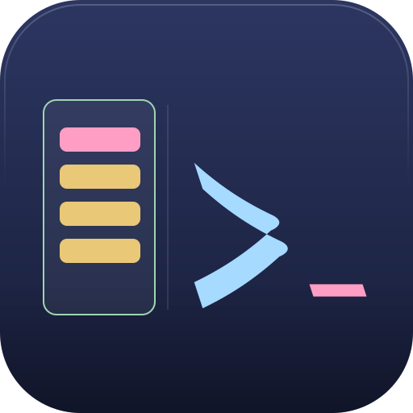
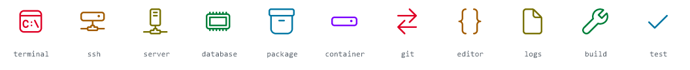
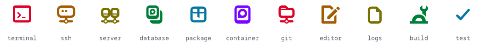

#  axan

A tree-of-shells terminal UI — a vertical sidebar tree of shells/agents under one window, instead of a tab bar. Built for the dev workflow where you want several shells open side-by-side, grouped into a tree you can see at a glance. In other words, I don't like tabs, I've never liked tabs. My hate for tabs is irrational and unreasonable and all-encompassing. For years have I toiled under the yoke of software designers who force tabs upon me against my will and I say, "No more shall your evil crush my spirit!"


## Architecture

axan is not a terminal emulator. It is a tree-of-shells UI that stands on the mature native terminal each OS already has — the only new thing it builds is the tree. On each platform axan embeds the most stable native terminal available and builds a thin native frontend that owns only the session tree (the launch-entry model, self-healing hierarchy repair, templated labels, the icon grammar, TOML interchange, and structured logging):

- **Linux** — a fork of gnome-terminal 3.52 hosting **VTE** (GTK3). VTE does the emulation; axan replaces the tabs with the session tree. The diff is concentrated in the sidebar widget (`terminal-sidebar.cc`), the Preferences Startup tab, the launch-entry machinery, and a couple of D-Bus additions (extra `CreateInstance` options plus a `CaptureWindowState` method) — the find bar, profile machinery, and accelerators are untouched gnome-terminal.
- **Windows** — a fork of **Windows Terminal** `v1.24.11321.0` (WinUI 2.8 / XAML Islands). Windows has no embeddable native terminal widget, so axan forks the whole app to obtain its `TermControl`, guts the tab strip, and hosts the control per tree node. WSL shells are ordinary nodes (`wsl.exe -d <distro>` over ConPTY).
- **macOS** — deferred, possibly permanently. A Mac reaches axan-on-Linux over SSH.

Both forks are **frozen, not tracked**: pinned to the vendored tag, with only security fixes cherry-picked and upstream feature churn deliberately ignored (pin details in [`windows/VENDOR`](./windows/VENDOR)).

Embedding the native widget means selection, IME, accessibility, scrollback, and rendering are inherited, never reimplemented — and the sidebar deliberately looks different per platform (GTK tree vs. WinUI `TreeView`).

## What's in this repo

| Dir | What it is | Substrate | License |
|---|---|---|---|
| [`linux/`](./linux) | The Linux frontend | gnome-terminal 3.52 + VTE fork, GTK3 | GPLv3 (root `COPYING`) |
| [`windows/`](./windows) | The Windows frontend | Windows Terminal fork (`v1.24.11321.0`), WinUI 2.8 | MIT (`windows/LICENSE`) |

Root `COPYING.GFDL` covers the GNOME-inherited help/man documentation under `linux/`.

## Building

Each frontend builds with its own toolchain on its own OS.

### Linux

meson + ninja against `linux/`. The dependency story is the same on every distro; only the package names differ:

| Dependency | Min version |
|---|---|
| vte-2.91 | 0.76.0 |
| gtk+-3.0 | 3.22.27 |
| libhandy-1 | 1.6.0 |
| glib-2.0 | 2.52.0 |
| libpcre2-8 | 10.00 |
| gsettings-desktop-schemas, libuuid, tomlplusplus, libX11 (X11 build only) | — |
| C++17 compiler, meson + ninja | — |

**Debian / Ubuntu** — VTE in apt is usually older than 0.76, so you will probably need to build VTE from source first (see the [VTE README](https://gitlab.gnome.org/GNOME/vte/-/blob/master/README.md)):

```sh
sudo apt-get build-dep libvte-2.91-0 gnome-terminal
sudo apt-get install g++ libtomlplusplus-dev
```

**Fedora** — validated against a fresh Fedora 44 install (June 2026). Fedora 42+ ships VTE 0.78+ in the main repo, so no source build of VTE is needed:

```sh
sudo dnf install \
    meson ninja-build gcc-c++ pkgconf-pkg-config itstool libxslt docbook-style-xsl \
    vte291-devel gtk3-devel libhandy-devel \
    glib2-devel gsettings-desktop-schemas-devel \
    pcre2-devel libuuid-devel libX11-devel \
    tomlplusplus-devel nautilus-devel \
    desktop-file-utils gettext
```

`nautilus-devel` provides `libnautilus-extension-4` for the file-manager integration, on by default — pass `-Dnautilus_extension=false` to `meson setup` to drop it (and omit `nautilus-devel`). `itstool` and `libxslt` are hard-required to build the AppStream metainfo and process the UI XML; `docbook-style-xsl` supplies the stylesheet the man-page build resolves via `--nonet`. All three are only needed for the default `docs=true` build — pass `-Ddocs=false` to skip the man page and yelp help entirely.

**Fedora on WSL** — axan runs under WSLg (no separate X server). Once before installing: enable systemd in `/etc/wsl.conf` (`[boot]` / `systemd=true`) so D-Bus user-session activation works, then `wsl --terminate <distro>` from Windows to pick it up. After that everything matches bare-metal Fedora.

**Build and run:**

```sh
cd linux
meson setup build --prefix="$HOME/.local"
ninja -C build
meson install -C build
axan
```

A non-root prefix like `~/.local` is the supported configuration. axan uses a D-Bus-activated server, so after reinstalling over a running instance the old server may still answer — kill `axan-server` and D-Bus will activate the newly installed binary. For build-without-install iteration, run the server directly under a scratch app id:

```sh
./build/src/axan-server --app-id test.Axan &
./build/src/axan --app-id test.Axan
```

**Debugging** — build with `-Ddbg=true`, then set `AXAN_DEBUG` (comma-separated flags, or `all`; values in `enum TerminalDebugFlags`, `linux/src/terminal-debug.hh`):

```sh
AXAN_DEBUG=selection,draw,cell axan-server
```

### Windows

Visual Studio 2022 / MSBuild against `windows/OpenConsole.sln` (present at the pinned tag; upstream later dropped it). Import `windows/.vsconfig` into the VS Installer for the exact component set. The repo root carries the working build scripts:

- `.build-release.ps1` — Release|x64 package build (signing via a machine-local cert; assets staged under `.release/`).
- `.deploy-cascadia.ps1 [-Rebuild] [-Launch]` — Debug|x64 dev build, deployed the way VS F5 does (`DeployAppRecipe.exe` over the loose AppX layout). You cannot run the loose `axan.exe` directly — packaged apps need identity, so build + deploy + launch is the loop. Pass `-Rebuild` after any preprocessor define change (e.g. branding), since MSBuild's timestamp check won't recompile for those.

Two toolchain notes are baked into the scripts: parallelism is capped (`CL_MPCount=8`, `/m:6`) because `TerminalSettingsModel`'s PCH exhausts memory on many-core machines, and clean rebuilds run Clean and Build as separate passes because a one-pass `/t:Rebuild` races the MIDL codegen.

## Configuration

The rule on every platform: **the native config store is canonical** — the running app reads only it. Linux reads GSettings/dconf; Windows reads Windows Terminal's `settings.json`. A portable **TOML mirror** carries settings between machines and platforms: importing writes into the native store, exporting reads from it. Omit a key in the TOML and the native value is left untouched.

### The launch-entry tree

The curated startup tree — which shells to spawn, in what hierarchy — is a list of **launch entries**. Every entry has the same fields on both platforms:

| Field | Meaning |
|---|---|
| `id` | stable minted UUID; reorder/reparent never break references |
| `parent-id` | parent entry's `id`; `""` = root; forward references only (a parent appears earlier in the list) |
| `name` | label template (see below); `""` = fallback chain (OSC title → directory basename → "shell") |
| `directory` | working directory; `~` = home; `""` = the directory axan launched from |
| `command` | raw command; `""` = the profile's login shell |
| `icon` | icon id (see the icon grammar below) |
| `color` | recolor token — `red orange yellow green blue purple` (theme-resolved) or literal `#RRGGBB`; sparse (omitted when empty) |
| `color-target` | `icon` \| `text` \| `both`; sparse (omitted when empty or `both`) |

`command` is stored raw. The per-shell survival wrap that keeps a node alive after its command exits (Linux `$SHELL -c "…; exec $SHELL"`, pwsh `-NoExit -Command`, cmd `/k`, WSL `bash -ic "…; exec bash -i"`) is applied at spawn time, never stored, so the command ports across platforms. Malformed trees self-heal on load: orphans and dangling parents promote to root, missing UUIDs are backfilled. The tree is honored only when the CLI asks for no shells of its own — `--tab`, `--working-directory`, and positional commands take precedence.

**Where the tree lives natively:**

- **Windows** — a single global `startupSessions` array on the root of WT's `settings.json` (camelCase keys: `id`, `parent`, `profile`, `name`, `directory`, `command`, `icon`, `color`, `colorTarget`). Each entry additionally carries `profile` — the GUID of the WT profile it spawns under (which shell: cmd/pwsh/WSL distro), empty = the default profile. One workstation tree, mixed shells, edited on the global **Startup sessions** settings page. WT's profiles keep owning appearance and the shell commandline; axan entries reference them.
- **Linux** — a per-profile `default-launch-entries` GSettings key (an `a(ssssssss)` tuple array). GNOME Terminal has one shell per profile, so there is no per-entry profile reference; entries run under the owning profile. The Preferences → Startup tab is the GUI editor; **⌖ Capture current window** snapshots the live sidebar tree (cwd + name + hierarchy, not commands) into the edited profile's entries, and **⌖ Capture as new profile…** does the same into a fresh profile cloned from the current one.

### The portable TOML

Every file starts with a version block:

```toml
[meta]
axan-toml-version = 1       # interchange schema version; newer versions are rejected
exported-by       = "windows"   # provenance, advisory only
```

Keys axan designs are **kebab-case, always** (`parent-id`, `color-target`, `axan-toml-version`). Unknown keys are skipped with a logged warning, never an abort.

**The startup tree** exports as `startup-sessions.toml` (Windows writes it to the package `LocalState`; auto-exported on settings change, imported via the Startup sessions page):

```toml
[[startup-sessions]]
id           = "b1dcc9dd-5262-4d8d-a863-c897e6d979b9"
parent-id    = ""                 # "" = root
profile      = "61c54bbd-…"       # referenced profile GUID; omitted = default profile
profile-name = "PowerShell"       # cross-machine fallback: import matches GUID first, then name
name         = "$dir $branch"
directory    = "~"
command      = "claude"
icon         = "builtin:terminal"
color        = "blue"             # sparse
color-target = "icon"             # sparse
```

**Whole profiles** export as per-profile `<uuid>.toml` mirrors with two layers: a portable core (`[profile]` — `uuid`, `name`, and the entry tree) that round-trips across platforms, and an opaque native passthrough (`[profile.native.linux]` / `[profile.native.windows]`) carrying each platform's remaining settings verbatim in their native casing (gschema kebab / WT camelCase). The importing platform applies the block matching its own OS and ignores the other — a Linux→Windows import drops Linux appearance scalars by design rather than mistranslating them.

Known gap: the Linux profile export is still a flat `[profile]` table of gschema keys — it does not yet emit the `[meta]` version block or nest its platform scalars under `[profile.native.linux]` as described above; the portable core (uuid, name, launch entries) uses the canonical keys and round-trips today.

### Label templates

An entry's `name` is a template, expanded at render time (same vocabulary on both platforms): `$pwd $cwd $dir $~ $user $host $hostname $shell $cmd $title $branch $repo` and `${file:path}` (first line of a file). `$branch`/`$repo` are computed by walking up from the shell's live cwd to `.git` — including WSL cwds via `\\wsl.localhost\…` paths. Unknown variables render literally. Live cwd tracking comes from shell integration axan injects at spawn (OSC 9;9 / OSC 7 emit for pwsh, cmd, and WSL bash). Variable names are case-insensitive and `-`/`_` are interchangeable; `$branch` and `${file:…}` refresh on the shell's next OSC event (the prompt redraw after a `cd` or `git checkout`), not in real time.

### Icons

<picture>
  <source media="(prefers-color-scheme: dark)" srcset="assets/builtin-icons-dark.png">
  
</picture>
<picture>
  <source media="(prefers-color-scheme: dark)" srcset="assets/builtin-icons-linux-dark.png">
  
</picture>

*The `builtin:` vocabulary rendered natively twice — Segoe Fluent glyphs on Windows (top), GTK symbolic icons from the system theme on Linux (bottom), tinted with the six palette colors. The names are the portable part: a tree written on one OS draws in the other's native glyphs.*

The icon field's grammar:

- `""` — no icon; a default placeholder glyph.
- `builtin:NAME` — the portable vocabulary, rendered natively per platform (symbolic icons on Linux, Segoe Fluent glyphs on Windows). Eleven curated names, append-only: `terminal ssh server database package container git editor logs build test`.
- Native forms, carried verbatim and **not** portable: a file path or bare filename under `~/.config/axan/icons/` (Linux); a Segoe codepoint, emoji, or image/binary path (Windows). On import to the other platform an unrecognized native icon falls back to the placeholder with a logged warning — never mistranslated.

An entry with no icon of its own inherits one: node override → the profile's icon → a stable auto-assigned glyph (hashed from the profile, so it survives relaunch).

### Adding your own icons

**Linux** — drop `.svg` files into `~/.config/axan/icons/`, then run `axan --import-icons` (or the import button in Preferences). Each file is validated before it reaches the picker: the filename must match `name.svg` (lowercase ASCII, starts alphanumeric, dashes/underscores allowed), the file must be under 100 KiB, and it must actually render at sidebar size. Passing names are registered in `~/.config/axan/icons.toml`; the picker reads that registry, not the folder, so a failing file is reported with a reason and stays out of the dropdown. Reference a registered icon by its bare filename, or any image on disk by absolute path. The importer is SVG-only because vectors scale cleanly — but the resolver renders whatever gdk-pixbuf can load, so if you'd rather use a PNG, a WebP, or for some reason an animated GIF, drop it in the folder, set the entry's `icon` to the bare filename by hand, and it will render; it just won't appear in the picker, which is reserved for validated SVGs.

**Windows** — right-click a session node (or use the titlebar app menu) → **Edit node (label + icon)…**. Pick one of the built-in glyphs, or **Browse to icon file…** to use an image (PNG/ICO/SVG) or extract an icon from an exe/dll. The recolor swatches tint the glyph and/or the label text (the `color`/`color-target` fields). When hand-editing `settings.json` or the TOML instead, the `icon` string also accepts a Segoe Fluent/MDL2 glyph character or an emoji directly. Overrides persist per node and survive relaunch.

### Sidebar and backdrop transparency (Windows)

By default the sidebar and the surface behind the terminal panes are opaque, so a profile with reduced opacity or acrylic composites over a solid app-colored backdrop rather than the live desktop. A theme in `settings.json` can change both with two axan-only keys, `sidebar.background` and `content.background`, which take the same values as Windows Terminal's `tabRow.background`: `"#RRGGBB"`, `"#RRGGBBAA"`, `"accent"`, or `"terminalBackground"`. Alpha is honored, so `"#00000080"` is a half-transparent scrim, `"#00000000"` is fully see-through, and `"terminalBackground"` follows the focused terminal's background. Leave a key unset and that surface keeps today's opaque look. For example:

```json
"themes": [
    {
        "name": "glass",
        "sidebar": { "background": "#00000080" },
        "content": { "background": "#00000000" }
    }
],
"theme": "glass"
```

## Logging

Structured, file-only logs (RFC 5424-inspired: timestamp, level, component, a structured-data block of key/values, message). Linux writes `~/.cache/axan/axan.log`; Windows writes `%LOCALAPPDATA%\Packages\sh.axan.Axan_…\LocalState\logs\axan.log`. Nothing goes to stdout, and a logging failure is never allowed to take down the terminal.
